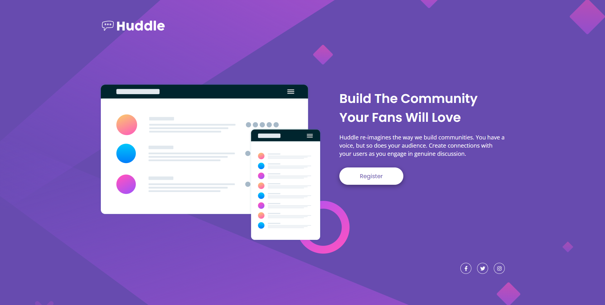
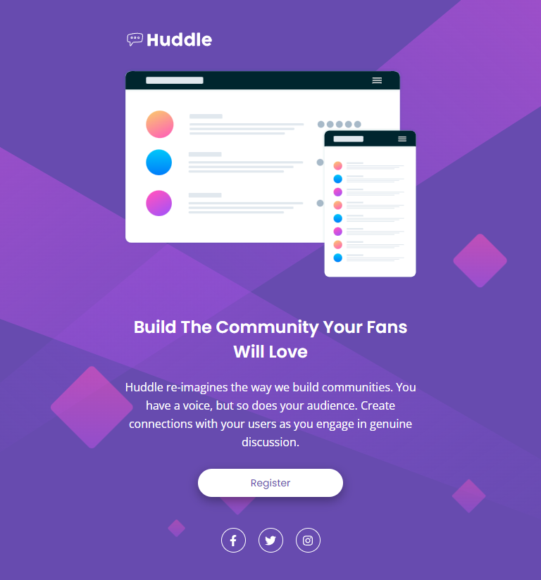

<div align="center">
  
</div>
<h1 align="center">
  Huddle Landing Page
</h1>
<p align="center">
  <a href="https://jonathanbenedito.github.io/huddle-landing-page-single/" target="_blank">Huddle Landing Page</a> é uma landing page de página simples sem scroll que ocupa a tela inteira do navegador. Feito para o desafio do curso DevQuest.
</p>




## 🛠 Guia de instalação

1. Faça o clone do projeto
    ```
    git clone https://github.com/jonathanBenedito/huddle-landing-page-single.git
    ```

2. Acesse o repositório
    ```
    cd huddle-landing-page-single
    ```

## 💬 Sobre o projeto

### O desafio

A proposta é construir uma simples página que ocupe a tela inteira utilizando duas colunas, utilizando somente HTML5 e CSS3. O layout deve aparentar o mais próximo possível do design fornecido pelo Frontend Mentor e ser
responsivo para diferentes tamanhos de tela.

### Fotos (Mobile)

|   |  |
|:---:|:---:|
| Smartphone layout | Tablet layout |

### Links

Website: <a href="https://jonathanbenedito.github.io/huddle-landing-page-single/">jonathanbenedito.github.io/huddle-landing-page-single/</a><br />
Desafio do Frontend Mentor: <a href="https://www.frontendmentor.io/challenges/huddle-landing-page-with-a-single-introductory-section-B_2Wvxgi0">www.frontendmentor.io/challenges/huddle-landing-page-with-a-single-introductory-section-B_2Wvxgi0</a>

### Tecnologias

O website foi construído usando apenas HTML5 e CSS3.

<div style="display: flex; margin-top: 15px; gap: 20px;">
  
  
</div>

